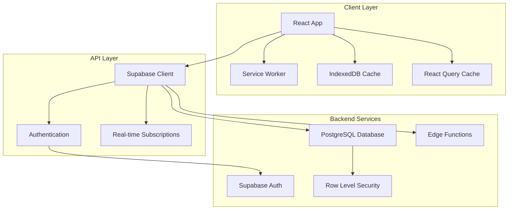
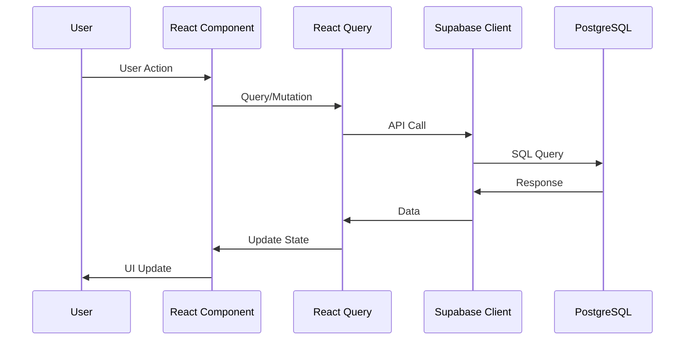

# Design Document

## Overview

The Gym Tracker is a modern Progressive Web App (PWA) built with React 18, TypeScript, and Supabase. The application follows a mobile-first design approach with a clean, minimalist interface optimized for fitness tracking. The architecture emphasizes performance, offline capabilities, and user experience while maintaining security and scalability.

The system uses a client-side architecture with Supabase handling authentication, database operations, and real-time features. The frontend implements a component-based design system with CSS Modules for styling, React Query for state management, and a service worker for PWA functionality.

## Architecture

### High-Level Architecture



### Technology Stack

**Frontend:**
- React 18 with TypeScript for type safety and modern React features
- Vite for fast development and optimized builds
- CSS Modules for component-scoped styling without TailwindCSS
- React Router for client-side routing
- React Query (TanStack Query) for server state management
- Zustand for client-side state management
- React Hook Form with Zod for form validation
- Recharts for data visualization
- i18next for internationalization

**Backend:**
- Supabase for Backend-as-a-Service
- PostgreSQL with Row Level Security (RLS)
- Supabase Auth for user authentication
- Real-time subscriptions for live updates

**PWA Features:**
- Service Worker with Workbox for caching strategies
- Web App Manifest for installability
- IndexedDB for offline data storage
- Background sync for data synchronization

### Data Flow Architecture



## Components and Interfaces

### Core Component Architecture

The application follows a feature-based folder structure with shared UI components:

```
src/
├── components/ui/          # Reusable UI components
│   ├── Button/
│   ├── Input/
│   ├── Card/
│   ├── Modal/
│   └── Chart/
├── features/               # Feature-specific components
│   ├── auth/
│   ├── dashboard/
│   ├── workouts/
│   ├── progress/
│   ├── planning/
│   └── settings/
├── hooks/                  # Custom React hooks
├── lib/                    # Utilities and configuration
├── store/                  # Global state management
└── types/                  # TypeScript definitions
```

### Design System Components

**Base UI Components:**
- `Button`: Primary, secondary, ghost variants with loading states
- `Input`: Text, number, email, password with validation states
- `Card`: Container component with elevation and padding variants
- `Modal`: Overlay component with backdrop and focus management
- `Select`: Dropdown component with search and multi-select support
- `DatePicker`: Calendar component for date selection
- `Chart`: Wrapper components for Recharts with consistent theming

**Layout Components:**
- `AppLayout`: Main application shell with navigation
- `AuthLayout`: Authentication pages layout
- `OnboardingLayout`: Onboarding flow layout with progress indicator
- `BottomNavigation`: Mobile navigation component
- `TopBar`: Header component with user menu and actions

### Feature Components

**Authentication Feature:**
```typescript
interface AuthComponents {
  SignInForm: React.FC<{ onSuccess: () => void }>;
  SignUpForm: React.FC<{ onSuccess: () => void }>;
  ResetPasswordForm: React.FC<{ onSuccess: () => void }>;
  AuthGuard: React.FC<{ children: React.ReactNode }>;
}
```

**Workout Feature:**
```typescript
interface WorkoutComponents {
  TodayWorkout: React.FC;
  ExerciseCard: React.FC<{ exercise: Exercise; sets: ExerciseSet[] }>;
  SetInput: React.FC<{ set: ExerciseSet; onChange: (set: ExerciseSet) => void }>;
  WorkoutTimer: React.FC<{ onComplete: () => void }>;
  WorkoutHistory: React.FC;
}
```

**Progress Feature:**
```typescript
interface ProgressComponents {
  WeightChart: React.FC<{ data: WeightLog[]; unit: 'kg' | 'lbs' }>;
  ProgressStats: React.FC<{ userId: string }>;
  WeightLogger: React.FC<{ onSave: (weight: WeightLog) => void }>;
}
```

### State Management Architecture

**Global State (Zustand):**
```typescript
interface AppStore {
  // User preferences
  theme: 'dark' | 'light' | 'system';
  language: 'en' | 'es';
  units: 'metric' | 'imperial';
  
  // UI state
  isOnboarding: boolean;
  activeWorkout: string | null;
  
  // Actions
  setTheme: (theme: string) => void;
  setLanguage: (language: string) => void;
  setUnits: (units: string) => void;
}
```

**Server State (React Query):**
- User profile and preferences
- Workout data and exercise logs
- Weight tracking data
- Exercise library
- Calendar and planning data

## Data Models

### Database Schema

**User Profile:**
```sql
create table public.profile (
  user_id uuid primary key references auth.users(id) on delete cascade,
  display_name text,
  locale text default 'en',
  units text default 'imperial',
  theme text default 'dark',
  created_at timestamptz default now(),
  updated_at timestamptz default now()
);
```

**Weight Tracking:**
```sql
create table public.weight_logs (
  id bigserial primary key,
  user_id uuid references auth.users(id) on delete cascade,
  measured_at date not null,
  weight numeric(6,2) not null,
  note text,
  created_at timestamptz default now(),
  unique (user_id, measured_at)
);
```

**Workout Planning:**
```sql
create table public.plans (
  id bigserial primary key,
  user_id uuid references auth.users(id) on delete cascade,
  goal_days_per_week int not null check (goal_days_per_week between 1 and 7),
  plan_scope text not null default 'weekly',
  start_date date not null,
  meta jsonb default '{}'::jsonb,
  created_at timestamptz default now()
);

create table public.workouts (
  id bigserial primary key,
  user_id uuid references auth.users(id) on delete cascade,
  plan_id bigint references public.plans(id) on delete cascade,
  date date not null,
  title text not null,
  is_completed boolean default false,
  duration_minutes int,
  notes text,
  created_at timestamptz default now(),
  unique (user_id, date)
);
```

**Exercise Management:**
```sql
create table public.exercises (
  id bigserial primary key,
  user_id uuid references auth.users(id) on delete cascade,
  workout_id bigint references public.workouts(id) on delete cascade,
  slug text not null,
  name_en text not null,
  name_es text not null,
  machine_brand text,
  order_index int default 0,
  target_sets int default 3,
  target_reps int default 10,
  created_at timestamptz default now()
);

create table public.exercise_sets (
  id bigserial primary key,
  user_id uuid references auth.users(id) on delete cascade,
  exercise_id bigint references public.exercises(id) on delete cascade,
  set_index int not null,
  weight numeric(6,2),
  reps int,
  rpe numeric(3,1),
  notes text,
  created_at timestamptz default now()
);
```

### TypeScript Interfaces

**Core Data Types:**
```typescript
interface User {
  id: string;
  email: string;
  profile: UserProfile;
}

interface UserProfile {
  user_id: string;
  display_name: string;
  locale: 'en' | 'es';
  units: 'metric' | 'imperial';
  theme: 'dark' | 'light' | 'system';
  created_at: string;
  updated_at: string;
}

interface WeightLog {
  id: number;
  user_id: string;
  measured_at: string;
  weight: number;
  note?: string;
  created_at: string;
}

interface Workout {
  id: number;
  user_id: string;
  plan_id: number;
  date: string;
  title: string;
  is_completed: boolean;
  duration_minutes?: number;
  notes?: string;
  exercises: Exercise[];
}

interface Exercise {
  id: number;
  workout_id: number;
  slug: string;
  name_en: string;
  name_es: string;
  machine_brand?: string;
  order_index: number;
  target_sets: number;
  target_reps: number;
  sets: ExerciseSet[];
}

interface ExerciseSet {
  id: number;
  exercise_id: number;
  set_index: number;
  weight?: number;
  reps?: number;
  rpe?: number;
  notes?: string;
  completed: boolean;
}
```

### Workout Template System

**Template Structure:**
```typescript
interface WorkoutTemplate {
  name: string;
  exercises: TemplateExercise[];
}

interface TemplateExercise {
  slug: string;
  name_en: string;
  name_es: string;
  target_sets: number;
  target_reps: number;
  muscle_groups: string[];
  equipment?: string;
}

const WORKOUT_TEMPLATES = {
  3: { // 3 days per week
    A: [
      { slug: 'chest-press', name_en: 'Chest Press', name_es: 'Press de Pecho', target_sets: 3, target_reps: 10, muscle_groups: ['chest', 'triceps'] },
      { slug: 'seated-row', name_en: 'Seated Row', name_es: 'Remo Sentado', target_sets: 3, target_reps: 10, muscle_groups: ['back', 'biceps'] },
      // ... more exercises
    ],
    B: [/* ... */],
    C: [/* ... */]
  },
  4: { // 4 days per week - Upper/Lower split
    'Upper A': [/* ... */],
    'Lower A': [/* ... */],
    'Upper B': [/* ... */],
    'Lower B': [/* ... */]
  }
};
```

## Error Handling

### Error Handling Strategy

**Client-Side Error Handling:**
```typescript
// Global error boundary for React errors
class ErrorBoundary extends React.Component {
  componentDidCatch(error: Error, errorInfo: ErrorInfo) {
    // Log error to monitoring service
    console.error('React Error:', error, errorInfo);
  }
}

// API error handling with React Query
const useWorkouts = () => {
  return useQuery({
    queryKey: ['workouts'],
    queryFn: fetchWorkouts,
    onError: (error) => {
      // Handle specific error types
      if (error.message.includes('auth')) {
        // Redirect to login
      } else {
        // Show user-friendly error message
      }
    }
  });
};
```

**Supabase Error Handling:**
```typescript
interface ApiResponse<T> {
  data: T | null;
  error: PostgrestError | null;
}

const handleSupabaseError = (error: PostgrestError) => {
  switch (error.code) {
    case 'PGRST116': // Row not found
      return 'Data not found';
    case '23505': // Unique violation
      return 'This entry already exists';
    case '42501': // Insufficient privilege
      return 'Access denied';
    default:
      return 'An unexpected error occurred';
  }
};
```

**Offline Error Handling:**
```typescript
// Service worker error handling
self.addEventListener('fetch', (event) => {
  event.respondWith(
    fetch(event.request)
      .catch(() => {
        // Return cached response or offline page
        return caches.match(event.request) || caches.match('/offline.html');
      })
  );
});
```

### Validation and Data Integrity

**Form Validation with Zod:**
```typescript
const workoutSchema = z.object({
  title: z.string().min(1, 'Title is required').max(100, 'Title too long'),
  date: z.string().regex(/^\d{4}-\d{2}-\d{2}$/, 'Invalid date format'),
  exercises: z.array(z.object({
    slug: z.string().min(1),
    target_sets: z.number().min(1).max(20),
    target_reps: z.number().min(1).max(100)
  })).min(1, 'At least one exercise required')
});

const weightLogSchema = z.object({
  weight: z.number().min(20).max(800, 'Weight must be between 20-800 lbs'),
  measured_at: z.string().regex(/^\d{4}-\d{2}-\d{2}$/),
  note: z.string().max(500).optional()
});
```

## Testing Strategy

### Testing Approach

**Unit Testing:**
- Component testing with React Testing Library
- Hook testing with @testing-library/react-hooks
- Utility function testing with Jest
- Form validation testing

**Integration Testing:**
- API integration tests with MSW (Mock Service Worker)
- Database operation tests with Supabase test client
- Authentication flow testing
- Offline functionality testing

**E2E Testing:**
- Critical user journeys with Playwright
- PWA installation and offline testing
- Cross-browser compatibility testing
- Mobile device testing

**Performance Testing:**
- Lighthouse CI for performance monitoring
- Bundle size analysis with webpack-bundle-analyzer
- Core Web Vitals monitoring
- Memory leak detection

### Test Structure

```typescript
// Component test example
describe('ExerciseCard', () => {
  it('should display exercise information correctly', () => {
    const exercise = mockExercise();
    render(<ExerciseCard exercise={exercise} sets={[]} />);
    
    expect(screen.getByText(exercise.name_en)).toBeInTheDocument();
    expect(screen.getByText(`${exercise.target_sets} sets`)).toBeInTheDocument();
  });
  
  it('should handle set completion', async () => {
    const onSetComplete = jest.fn();
    render(<ExerciseCard exercise={mockExercise()} sets={[]} onSetComplete={onSetComplete} />);
    
    const completeButton = screen.getByRole('button', { name: /complete set/i });
    await user.click(completeButton);
    
    expect(onSetComplete).toHaveBeenCalled();
  });
});

// API test example
describe('Workout API', () => {
  it('should create workout successfully', async () => {
    const workoutData = mockWorkoutData();
    const result = await createWorkout(workoutData);
    
    expect(result.error).toBeNull();
    expect(result.data).toMatchObject(workoutData);
  });
});
```

### PWA Testing

**Service Worker Testing:**
```typescript
// Test offline functionality
describe('Offline Functionality', () => {
  beforeEach(() => {
    // Mock service worker registration
    Object.defineProperty(navigator, 'serviceWorker', {
      value: mockServiceWorker,
      writable: true
    });
  });
  
  it('should cache critical resources', async () => {
    const cache = await caches.open('gym-tracker-v1');
    const cachedResponse = await cache.match('/');
    expect(cachedResponse).toBeTruthy();
  });
  
  it('should work offline for core features', async () => {
    // Simulate offline mode
    mockNetworkFailure();
    
    render(<App />);
    expect(screen.getByText(/today's workout/i)).toBeInTheDocument();
  });
});
```

## Security Considerations

### Authentication Security

**Supabase Auth Configuration:**
- JWT tokens with secure expiration (1 hour access, 7 days refresh)
- Email verification required for new accounts
- Password strength requirements (minimum 8 characters, mixed case, numbers)
- Rate limiting on authentication endpoints
- Secure password reset flow with time-limited tokens

**Row Level Security (RLS) Policies:**
```sql
-- Users can only access their own data
create policy "Users can view own profile" on public.profile
  for select using (auth.uid() = user_id);

create policy "Users can update own profile" on public.profile
  for update using (auth.uid() = user_id);

create policy "Users can view own workouts" on public.workouts
  for select using (auth.uid() = user_id);

create policy "Users can manage own workouts" on public.workouts
  for all using (auth.uid() = user_id);
```

### Data Protection

**Client-Side Security:**
- Input sanitization and validation on all forms
- XSS protection through React's built-in escaping
- CSRF protection through Supabase's secure headers
- Secure storage of sensitive data (no localStorage for tokens)
- Content Security Policy (CSP) headers

**API Security:**
- HTTPS enforcement for all communications
- Request validation with Zod schemas
- Rate limiting on API endpoints
- SQL injection prevention through parameterized queries
- Audit logging for sensitive operations

### Privacy Compliance

**Data Minimization:**
- Collect only necessary user data
- Automatic data cleanup for inactive accounts
- User-controlled data export and deletion
- Clear privacy policy and terms of service

**GDPR Compliance:**
- User consent for data processing
- Right to data portability (export feature)
- Right to erasure (account deletion)
- Data processing transparency

## Performance Optimization

### Frontend Performance

**Code Splitting and Lazy Loading:**
```typescript
// Route-based code splitting
const Dashboard = lazy(() => import('../features/dashboard/Dashboard'));
const Workouts = lazy(() => import('../features/workouts/Workouts'));
const Progress = lazy(() => import('../features/progress/Progress'));

// Component-based lazy loading
const Chart = lazy(() => import('../components/ui/Chart/Chart'));
```

**Bundle Optimization:**
- Tree shaking for unused code elimination
- Dynamic imports for non-critical features
- Webpack bundle analysis and optimization
- Critical CSS inlining for above-the-fold content
- Image optimization with WebP format and lazy loading

**Caching Strategy:**
```typescript
// Service worker caching
const CACHE_STRATEGIES = {
  'app-shell': 'CacheFirst',      // Static assets
  'api-data': 'NetworkFirst',     // Dynamic data
  'images': 'CacheFirst',         // Exercise images
  'fonts': 'CacheFirst'           // Web fonts
};
```

### Database Performance

**Query Optimization:**
- Proper indexing on frequently queried columns
- Efficient pagination for large datasets
- Query result caching with React Query
- Database connection pooling

**Indexes:**
```sql
-- Performance indexes
create index idx_workouts_user_date on public.workouts(user_id, date);
create index idx_exercises_workout on public.exercises(workout_id);
create index idx_exercise_sets_exercise on public.exercise_sets(exercise_id);
create index idx_weight_logs_user_date on public.weight_logs(user_id, measured_at);
```

### PWA Performance

**Offline-First Architecture:**
- Critical data cached in IndexedDB
- Background sync for data synchronization
- Optimistic UI updates for better perceived performance
- Graceful degradation when offline

**Loading Performance:**
- App shell architecture for instant loading
- Skeleton screens for loading states
- Progressive image loading
- Preloading of critical resources

This comprehensive design addresses all requirements while providing a scalable, secure, and performant foundation for the Gym Tracker application. The architecture supports both current needs and future enhancements while maintaining code quality and user experience standards.